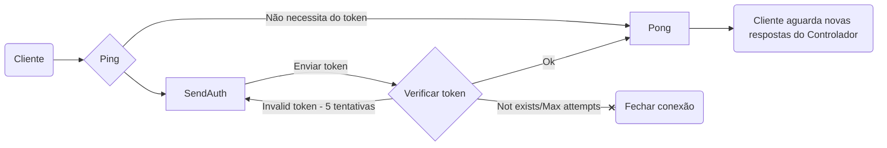

# Protocolo

- Client: Está modulo pode usar qual abstração do [`net.Conn`](https://pkg.go.dev/net#Conn) para conectar a um controlador como cliente
- Servidor/Controlador: a mesma coisa se estabelece para o controlador, basta passar um [`net.Listener`](https://pkg.go.dev/net#Listener) para processar novos clientes
- As struct's estão serelealizadas em BINARIO com [Big-Endian](https://pt.wikipedia.org/wiki/Extremidade_(ordena%C3%A7%C3%A3o)#Hardware_bi-endian)

## Cliente

- O Cliente dever manda um ping iniciamente para receber uma respostas, caso sejá requisitado uma altenticação, re-envia uma resposta para o controlador, o controlador deve apenas aceita as primeiras 5 tentativas de autenticação.
- O cliente deve sempre está escutando está conexão para processar as struct's.
- Valores invalidos devem ser ignorados por questão de vazamento de dados ou estouro de memoria.

## Servidor/Controlador

- O servidores devem receber um ping para checar se necessita de autenticação, caso neccesario mande uma respota `SendAuth` para que o cliente mande a chave de autenticação.
- Na etapa de autenticação, aceita apenas as primeiras 5 requisições do cliente, depois disso deve ser ENCERRADO a conexão sem possivel explicação para o cliente.
- O serviço que será implementado devera implementa uma Autenticação e uma forma para aceitar conexões UDP e TCP de forma parecida com o [`net.Listener`](https://pkg.go.dev/net#Listener), caso ao contrario será ignorado e não será aceito qualquer novos clients desta forma.
- Quando um cliente desconectar ou de forma inesperada será encaminha para o cliente que a conexão foi encerada.
- (Rascunho de implementação) O controlador não informarar quando um novo cliente será aceito pelo controlador, apenas enviarar o primeiros bytes recebidos por ele.